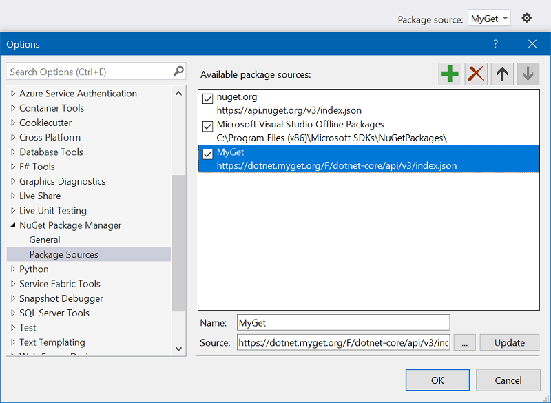

# The Power of Machine Learning meets the Power of Wonderful Food
Some instructions!

## NuGet Packages
The current version uses a special package feed to get ML.NET (this will change as soon as the new version is released).



The MyGet source url is `https://dotnet.myget.org/F/dotnet-core/api/v3/index.json`.

## Inception Model
You will need to download the Inception model from [here](https://storage.googleapis.com/download.tensorflow.org/models/inception5h.zip) in order to make the transfer learning part work. The file you need is called `tensorflow_inception_graph.pb`. Drop that file into the `Trainer` console app and make sure to `Copy to Output Directory`.

## Image Data
This part is a little trickier but totally doable! The first thing to do is get actual images to use in the training and validation process. To do that I use the handy [Bulk Bing Image Downloader](https://github.com/ostrolucky/Bulk-Bing-Image-downloader).

1. Get the python script
2. Create a file (I called it `tacos.txt`) and add the following:
```
tacos
burrito
```
3. Run the python script as follows:
```
python bbid.py -f tacos.txt -o data --filters +filterui:license-L2_L3_L4+filterui:imagesize-large
```
This will basically download images that conform to a bing query for each line in the text file. ([test it out for tacos](https://www.bing.com/images/search?&q=tacos&qft=+filterui:license-L2_L3_L4+filterui:imagesize-large)). The filters download data that is licensed appropriately as well.

4. Clean the data! Remove any images that will not work for this particular task.
5. Seperate the data into a `train` and `val` set. The `train` set is for training the Machine Learning model. The `val` set is used as a validation set to make sure the model is working properly. It is held out _on purpose_ so we are not cheating! My folder structure:

```
data
└───train
│   └───burrito
│   |       burrito_image1.jpg
│   |       another_burrito21.jpg
│   |       ...
│   └───tacos
│           taco_image1.jpg
│           another_taco21.jpg
│           ...
└───val
    └───burrito
    |       burrito_other1.jpg
    |       another_burrito272.jpg
    |       ...
    └───tacos
            taco_other1.jpg
            another_taco343.jpg
            ...
```
This folder (as currently coded) lives in the same folder as the solution file!

## Why are you making me do all of this?!?!
Basically because the files are not mine! I want to make sure you have access to the original files from their original locations. And also because this is how data science works!